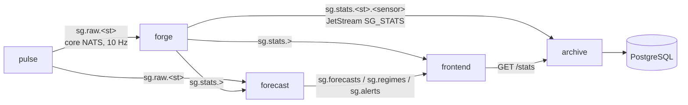

# SignalGrid architecture

How data moves through the system, what each service guarantees, and the
reasoning behind the models. For setup, see the [README](README.md).

## Data flow

| Service | Language | Responsibility |
| --- | --- | --- |
| pulse | Rust | Simulates N stations × 4 channels: a regime-switching multivariate Ornstein-Uhlenbeck process sampled on a 100 ms wall-clock grid |
| forge | Rust | Event-time tumbling windows (500 ms) per station and sensor: count, mean, min, max, majority ground-truth regime |
| archive | Rust | Durable JetStream consumer → batched idempotent Postgres writes; `GET /stats`, `/health`, `/ready` |
| forecast | Python | Per-series AR(1) forecasts with prediction intervals, online evaluation, per-station regime detection, alert rules |
| frontend | Python/Dash | Live dashboard fed by NATS, history backfilled from archive |
| core | Rust crate | Shared wire types, subject names, config, telemetry, shutdown handling |

## Subjects and contracts

| Subject | Producer | Payload | Delivery |
| --- | --- | --- | --- |
| `sg.raw.<station>` | pulse | `RawEvent`: timestamp, values[4], ground-truth regime | core NATS (at most once) |
| `sg.stats.<station>.<sensor>` | forge | `Stats`: window start, window_ms, mean/min/max/count, regime | JetStream stream `SG_STATS` (24 h, file storage) |
| `sg.forecasts.<station>.<sensor>` | forecast | horizon timestamps, point forecasts, interval bounds, per-horizon metrics | core NATS |
| `sg.regimes.<station>` | forecast | filtered state probabilities, detected/true regime, rolling accuracy | core NATS |
| `sg.alerts.<station>` | forecast | rule, severity, firing/resolved, scope, message | core NATS |

Golden examples live in [`contracts/`](contracts). The Rust core crate and
both Python packages parse them in their test suites, so a breaking schema
change fails CI on every side of the wire.

## Delivery guarantees (stats path)

1. **Publish.** Forge sends each closed window to JetStream with
   `Nats-Msg-Id = "<station>.<sensor>.<window start>"`. Within the stream's
   2-minute duplicate window the server drops re-publishes, e.g. after a forge
   restart. Acks are awaited off the hot path.
2. **Consume.** Archive pulls from the durable consumer `archive`
   (explicit ack, `ack_wait` 30 s) in batches of up to 500 messages or 1 s.
3. **Write.** Each batch is one `INSERT ... SELECT FROM UNNEST(...) ON CONFLICT
   (station, sensor, timestamp) DO NOTHING`. Only then are its messages acked.
   On a database error the batch is NAKed with a delay and retried with
   backoff. Unparseable messages are terminated so they cannot block the
   consumer.
4. **Shutdown.** SIGTERM stops fetching, finishes the in-flight batch, drains
   NATS and exits (about 1–2 s).

A crash between commit and ack leads to redelivery, which the primary key
turns into a no-op: **at-least-once delivery + idempotent writes =
effectively once**. `scripts/smoke_test.py` (run in CI) stops the archive for
8 s while data keeps flowing and asserts the stored series around the outage
has no gaps and no duplicates.

Raw samples use core NATS on purpose. At 10 Hz per station they are cheap to
lose and latency-critical; the windows derived from them are the system of
record.

## Windowing

* Windows are `[k·W, (k+1)·W)` on the **event** timestamp (`W = WINDOW_MS`,
  500 ms), so restarts or slow consumers never move samples between windows.
* Each station has its own **watermark** = newest event time − allowed
  lateness. A window closes when the watermark passes its end. One station
  publishes its subject in order, so lateness defaults to 0, and a station is
  never held back by a slower one.
* Pulse samples just after each 100 ms grid point, so the sample that closes
  a window arrives about 1 ms after the boundary. Window close → subscribers
  is ~3 ms p50 (it was ~220 ms with a global watermark, 200 ms lateness and
  free-running ticks).
* A window with no new samples for `IDLE_FLUSH_MS` is flushed anyway. Events
  for an already-closed window are counted as late (`forge_late_events_total`)
  and dropped.
* Memory is O(open windows × sensors): one running accumulator per sensor,
  never a buffer of raw events.

## Forecasting

Each series' last 60 window means are fitted with OLS as an AR(1) /
discretised OU process `x[t+1] = c + φ·x[t] + ε`, forecasting h = 1..3 windows.

* **Point forecast:** `x̂_h = c·S_h + φ^h·x_T` with `S_h = Σ_{j<h} φ^j`. Written
  in `(c, φ)` rather than `(μ, φ)`, it stays well defined at a unit root,
  where `μ = c/(1−φ)` is not.
* **Interval:** `t_{0.99, n−2} · sqrt(σ²·Σ_{j<h} φ^{2j} + g′ Σ g)`, where
  `Σ = σ²(X′X)⁻¹` is the full OLS covariance and `g = ∂x̂_h/∂(c, φ)`. For
  h = 1 this is the textbook OLS prediction interval.

  An earlier version used a `(φ, μ)` delta method and ignored their
  covariance. Whenever φ̂ landed near 1 the interval blew up to hundreds of
  times its usual width; a test now guards against that.
* **Evaluation:** every forecast registers its 1- and 3-step predictions.
  When the target window arrives, its absolute error, the error of
  persistence at the same horizon, and whether it fell inside the interval
  are recorded over the last 200 windows. That gives **MASE** (model MAE /
  persistence MAE: scale-free and safe for zero-centred signals, unlike MAPE)
  and empirical **coverage**, which should sit near the nominal 98 %.

## Regime detection

Pulse switches each station between 3 regimes with a sticky Markov chain;
regimes differ in mean, mean-reversion speed, volatility and cross-channel
correlation. The forecast service recovers them **without labels**:

* **Model:** Markov-switching VAR(1) on increments,
  `Δx_t | x_{t−1}, s_t=k ~ N(a_k + b_k ⊙ x_{t−1}, Σ_k)`. This is exactly the
  simulator's discretised dynamics.
* **Fit:** Baum–Welch EM (scaled forward–backward, closed-form weighted
  least-squares M-step) on the last 3 000 samples (5 min). It runs in a
  low-priority worker process every 60 s. EM finds local optima, so it
  restarts from the previous fit plus three volatility-quantile
  initialisations and keeps the best log-likelihood. The first fit waits for
  2 min of data: fitted earlier, it splits a regime it has seen into two.
* **Online:** a Hamilton filter step per sample gives `P(s_t | x_{1..t})`.
* **Labels:** fitted states are ordered by total volatility, which is stable
  across refits. Only for evaluation are they mapped to the simulator's
  labels, by Hungarian assignment on a rolling confusion matrix (the standard
  way to score unsupervised clustering). Replays score 88–95 % accuracy.

## Alerts

| Rule | Fires when | Severity | Resolves |
| --- | --- | --- | --- |
| anomaly | 2 consecutive window means outside the 1-step interval, or 1 more than a half-width outside | warning / serious | one-shot, 10 s cooldown per series |
| calibration | rolling 1-step coverage < 93 % (≥ 100 scored windows) | serious | coverage ≥ 95 % |
| model_degraded | rolling 1-step MASE > 1.10 | warning | MASE ≤ 1.02 |
| regime_change | a newly detected regime has held for 2 s | info | one-shot |
| regime_accuracy | detection accuracy < 70 % for 30 s | warning | accuracy ≥ 75 % |
| stale (frontend) | no new window for 6 window lengths | critical | data resumes |
| latency (frontend) | per-second median latency > 100 ms for 30 s | warning | condition clears |

A single miss of a 98 % interval is expected about 2 % of the time, so it
never alerts. Rolling-window rules use hysteresis, and sustained rules
require the condition to persist, so momentary spikes stay quiet.

## Dashboard update model

* A NATS thread feeds bounded in-memory buffers (15 min per series). Every
  chart is a fixed list of traces plus an invisible **range anchor** spanning
  the selected window, so all panels share the same x-range.
* A 250 ms poll re-renders a chart only when the view, selection, range,
  scale or data epoch changes. Otherwise it sends just the new points through
  `extendData`, capped to one range of points so old data cannot stretch the
  y-axis, or nothing at all.
* Polls never overlap (`running=` disables the interval while one is in
  flight). Figures are built as plain dicts, which avoids Plotly's per-point
  validation (full render: ~1 s → ~30–100 ms). Segmented controls are
  clientside callbacks.
* State lives in one gunicorn worker. Scaling out would move the buffers to
  Redis or push to browsers over WebSockets.

## Observability

Every service exposes Prometheus metrics on `:9000/metrics`: event and
window rates, late events, JetStream duplicates, window emit lag, archive
batch size and write time, MASE and coverage per series and horizon, regime
accuracy, EM fit time, and alerts by rule. Grafana is provisioned with the
"SignalGrid pipeline" dashboard. Logs are JSON (`LOG_FORMAT=json`).

## Failure behaviour

| Failure | Effect |
| --- | --- |
| archive or Postgres down | JetStream retains windows. On recovery the backlog is written once, in order. The dashboard is unaffected (it reads NATS directly). |
| forge restart | Open windows are flushed on SIGTERM. Re-published windows are de-duplicated by `Nats-Msg-Id` and the primary key. |
| pulse stops | Forge flushes idle windows, and the dashboard raises **stale data** alerts. |
| NATS restart | All clients reconnect automatically; the JetStream stream and consumer state persist on the `natsdata` volume. |
| frontend restart | Buffers refill from NATS, and history is backfilled from `GET /stats`. |
