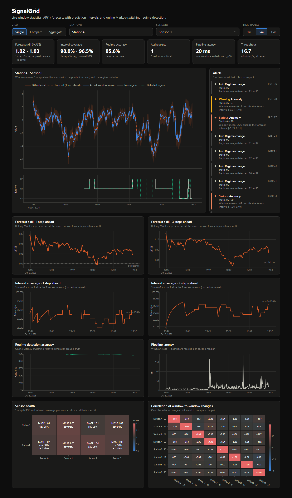
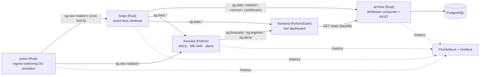

# SignalGrid

[](https://github.com/erdnuz/signalgrid/actions/workflows/ci.yml)


A real-time sensor pipeline: Rust services ingest, window and durably archive
multi-channel telemetry over NATS JetStream, and a Python service forecasts
every series with calibrated prediction intervals, scores itself online, and
detects hidden regime changes without labels. A live dashboard and a
Prometheus/Grafana stack show all of it.



## Highlights

| | |
| --- | --- |
| **Effectively-once archiving** | Forge publishes each window to JetStream with its identity as `Nats-Msg-Id` (server-side de-dup); archive acks only after a batched `INSERT ... ON CONFLICT DO NOTHING` commits. CI kills the archive mid-stream and checks the stored series has **no gaps and no duplicates**. |
| **~3 ms end-to-end** | Window close → subscribers in **3.2 ms p50 / 4.0 ms p99**. Event-time tumbling windows with per-station watermarks, grid-aligned sampling and non-blocking JetStream acks cut this from ~220 ms. |
| **Calibrated forecasts, measured live** | AR(1)/OU forecasts with t-based prediction intervals (OLS covariance via the delta method). Every forecast is scored when its target window arrives: rolling **MASE** vs. persistence and **interval coverage**, at 1 and 3 steps ahead. |
| **Unsupervised regime detection** | 3-state Markov-switching VAR(1) fitted by Baum–Welch EM (with restarts) in a worker process, filtered online with a Hamilton filter: **88–95 % accuracy** against the simulator's ground truth in replays. |
| **Alerting that ignores noise** | Consecutive or extreme interval misses, calibration drift, model worse than persistence, regime changes, regime-detection degradation, stale data and high latency. Sustained-condition rules use hysteresis, so blips never page. |
| **Incremental dashboard** | Single / Compare / Aggregate views, health grid and correlation matrix with click-through, alert feed. Steady-state updates send only new points (median 28 B per poll). |
| **Tested across languages** | Rust (unit, `proptest`, Postgres integration, criterion bench) and Python (pytest, strict mypy); shared JSON contracts checked on both sides; docker-compose end-to-end job in CI. |

## Architecture



See [Architecture.md](Architecture.md) for message contracts, delivery
guarantees, windowing semantics, the models and failure behaviour.

## Quickstart

Prerequisites: Docker with Compose v2.

```bash
git clone https://github.com/erdnuz/signalgrid && cd signalgrid
cp .env.example .env
docker compose up --build        # or: make up
```

| URL | What |
| --- | --- |
| <http://localhost:8004> | Dashboard |
| <http://localhost:3000> | Grafana (anonymous viewer, dashboard "SignalGrid pipeline") |
| <http://localhost:9090> | Prometheus |
| <http://localhost:8003/stats?station=StationA&sensor=0&limit=10> | Archive REST API |
| <http://localhost:8222> | NATS monitoring |

All ports bind to `127.0.0.1`. Forecasts start after ~10 s of data, and the
first regime model is fitted after ~2 min.

`make clean` (`docker compose down -v`) resets all data. Do that when
upgrading from an older checkout, since the schema and Postgres version changed.

## Using the dashboard

* **View**: *Single* shows one sensor in detail (forecast band, horizon,
  true vs. detected regime). *Compare* overlays any stations × sensors;
  switch *Scale* to z-score to compare shape rather than level.
  *Aggregate* shows each station's mean across sensors with the min–max envelope.
* **Time range**: 1, 5 or 15 minutes. Longer ranges would only re-plot
  500 ms windows the archive API already serves.
* **Sensor health**: MASE and coverage per sensor. Click a cell to inspect it.
* **Correlation matrix**: correlation of window-to-window *changes* (levels
  of mean-reverting signals are autocorrelated and would mislead). Click a
  cell to compare that pair.
* **Alerts**: newest first, each with icon, label and scope. Click one to
  inspect its series.

## Performance

Measured on a laptop (Docker Desktop, WSL2), whole stack running:

| Metric | Value |
| --- | --- |
| Window close → subscriber, p50 / p99 | 3.2 ms / 4.0 ms |
| Forge processing (closing sample → stats delivered), p50 | 1.1 ms |
| `WindowAggregator` throughput (criterion, 100k 4-channel events) | ~3.7 M events/s |
| Archive batch write (UNNEST, ~25 rows) | ~5 ms |
| Graceful stop (SIGTERM → exit), any service | 1–2 s |
| Dashboard steady-state update | 28 B when idle, ≤ 2.2 KB with new points |
| Regime EM refit (3 000 samples, 4 restarts, worker process) | ~2–4 s |

```bash
make bench      # criterion benchmark of the window aggregator
make smoke      # end-to-end: outage → no gaps, no duplicates
```

## Design decisions & trade-offs

* **Core NATS for raw samples, JetStream for windows.** Raw telemetry at
  10 Hz/station is cheap to lose and needs the lowest latency; window stats
  are the system of record, so they get persistence, de-duplication and
  acknowledged delivery.
* **Event time, not processing time.** Windows are aligned on sample
  timestamps, so a restart or a slow consumer cannot shift data between
  windows. Per-station watermarks with zero lateness work because each
  station's stream is ordered; `ALLOWED_LATENESS_MS` exists for producers
  that are not.
* **Idempotency at the storage boundary.** The natural key
  `(station, sensor, window start)` is the primary key, and duplicates
  become `ON CONFLICT DO NOTHING` instead of a coordination problem.
* **MASE over MAPE.** The signals are centred on zero, where percentage
  errors explode. MASE is scale-free, so sensors, stations and horizons
  can be compared, and it has a natural benchmark: below 1 beats persistence.
* **Regime labels are learned, and only evaluated against ground truth.**
  States are ordered canonically by volatility so they stay stable across
  refits. The Hungarian mapping to the simulator's labels is used only for
  scoring.
* **Dashboard state in process, deltas over polling.** A single gunicorn
  worker holds bounded buffers fed by a NATS thread; the browser receives
  only new points through `extendData`. Scaling out would move the buffers
  to Redis or push over WebSockets.
* **Plain PostgreSQL.** At 16 rows/s a B-tree on the natural key is plenty.
  TimescaleDB hypertables and continuous aggregates would be the next step
  for long retention.

## Development

```bash
make test       # cargo test (workspace) + pytest for both Python packages
make lint       # cargo fmt/clippy -D warnings, ruff, mypy --strict
```

Rust runs in the `rust:1.88` image, so no local toolchain is needed. Python
needs 3.12 and `pip install -r requirements-dev.txt` per package.

| Path | Contents |
| --- | --- |
| `services/core` | Shared Rust crate: wire types, subjects, config, telemetry, shutdown |
| `services/pulse` | Regime-switching multivariate OU simulator (Cholesky-correlated shocks) |
| `services/forge` | Event-time tumbling windows, JetStream publisher |
| `services/archive` | JetStream consumer, batched idempotent writes, migrations, REST API |
| `services/forecast` | AR(1) forecasting, online evaluation, MS-VAR regime detection, alerts |
| `frontend` | Dash dashboard (store, charts, incremental update logic) |
| `contracts` | Golden JSON messages checked by Rust and Python tests |
| `observability` | Prometheus scrape config, provisioned Grafana dashboard |
| `scripts/smoke_test.py` | End-to-end delivery-guarantee test used by CI |

### Configuration

| Variable | Default | Service |
| --- | --- | --- |
| `N_STATIONS` / `PUBLISH_INTERVAL_MS` / `SEED` | 2 / 100 / random | pulse |
| `WINDOW_MS` / `ALLOWED_LATENESS_MS` / `IDLE_FLUSH_MS` | 500 / 0 / 2000 | forge |
| `BATCH_MAX_MESSAGES` / `BATCH_MAX_WAIT_MS` | 500 / 1000 | archive |
| `FORECAST_HORIZON` / `EVAL_WINDOW` / `REGIME_WINDOW` | 3 / 200 / 3000 | forecast |
| `REFRESH_MS` / `MAX_POINTS` | 250 / 1800 | frontend |
| `RUST_LOG` / `LOG_FORMAT` | info / json | Rust services |

## License

[MIT](LICENSE)
